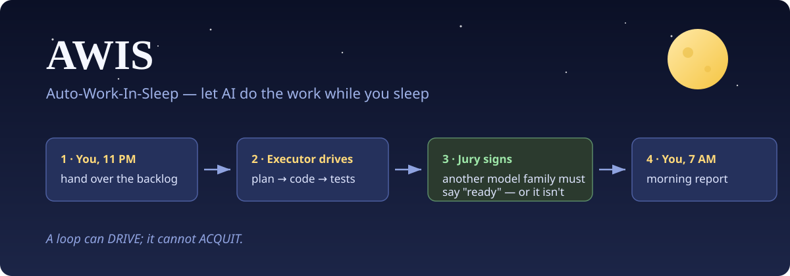

# AWIS 🌙 — Auto-Work-In-Sleep

<p align="center">
  
</p>

[](#快速开始) · [](docs/USAGE_CN.md) · [](#核心信条) · [](#三个-skill) · [](#诚实性与测试) · [](#评审路由) · [](LICENSE)

🌱 *AWIS 是一套纪律，不是一个平台。3 个 Markdown skill + 4 个纯标准库脚本 + 3 个 MCP 小桥 —— 你的 agent 去哪儿，它跟到哪儿。*

💡 *主力支持 [Kimi Code CLI](https://www.kimi.com/) 与 DeepSeek Harness（dsh）—— **Kimi 干的活由 DeepSeek 审，dsh 干的活由 Kimi 审** —— 有 Claude Code / Codex 也可以用。不需要 Claude 或 OpenAI 的 API key。*

⚔️ *[ARIS](https://github.com/wanshuiyin/Auto-claude-code-research-in-sleep)（Auto-**Research**-In-Sleep）的姊妹项目。ARIS 在 ML 研究上验证了过夜方法论；AWIS 把同一件武器对准**每个程序员的任务清单**。*

---

## 凌晨三点的问题

现在的编程 agent 都能连续自主工作几小时。于是你睡前丢给它一份任务清单。但凌晨三点，空无一人的房间里，实际发生的是什么？

- agent **给自己的作业打分**。"测试过了，我觉得没问题" —— 写出 bug 的那个脑子，宣布 bug 修好了。
- 一个没人回答的问题 —— *"要不要删旧表？"* —— **杀死一整夜**。你早上看到的，是凌晨 1:07 发出的一句礼貌提问，和之后七个小时的空转。
- 或者相反：午夜一个自信的错方向，到早上滚成 **400 行没人审过的 diff**。
- 或者什么都没坏 —— 循环只是**空转**：同一个失败重试 40 次，没有新信息，token 照烧。

AWIS 用一句话杀死第一种死法，用一套机器杀死后三种：

> **循环只能开车，不能签字。**

执行器可以开一整夜的车，但永远不许给自己的工作签字。每个工作项都必须拿到**异家族模型的裁决** —— Kimi 的产出由 DeepSeek 判，DeepSeek 的由 Kimi 判，谁的都可以由 Codex/GPT 判，或者由人工中转判 —— 裁决走一张确定性的、有测试覆盖的转移表（`tools/review_gate.py`），并写进 append-only 日志，早上你可以边喝咖啡边审计。同家族的喝彩**直接拒绝（fail-closed）**：宁可挂着，不可错放。

## 核心信条

| # | 原则 | 防的死法 |
|---|---|---|
| 1 | **循环只能开车，不能签字。** 客观门（测试 exit code）机器自判；质量门必须*异家族模型*签字 | 自己给自己打分 |
| 2 | **启动授权块。** 读仓、改白名单路径、跑测试 —— 默认放行；commit/push/删除/装软件 —— 必须点名 | 凌晨三点爆破半径 |
| 3 | **done ≠ accepted。** 续跑时重验每一个没被外部签字的阶段 | "它说它做完了" |
| 4 | **证据等级制。** 确定性门 → 新环境鲁棒性 → 跨模型评审。低级证据不充高级验收 | 固定夹具表演 |
| 5 | **失败三分类。** capability gap / environment flake / test design flaw。空转 2 轮强制换思路，4 轮上报你 | 40 次重试的空转 |
| 6 | **定时器只等事实，不判胜负。** 定时等待仅用于外部事实 | 调度器和循环打架 |
| 7 | **人类卡点三条出路。** 能自决的记审计日志自决 → 推手机（飞书）→ 标 🛑 继续下一项 | 凌晨 1:07 的提问 |
| 8 | **晨报 5 行。** 过了 / 没过 / 证据 ID / commit 状态 / 下一步 | 早上考古 |

## 快速开始

```bash
git clone https://github.com/tongriyaotxt/AWIS.git && cd AWIS
bash install.sh          # skills → ~/.kimi/skills（+ ~/.claude/skills），MCP 自动注册
# 把评审指向"对面"家族的 API（一段环境变量）：
export LLM_API_KEY=sk-... LLM_BASE_URL=https://api.deepseek.com/v1 LLM_MODEL=deepseek-chat
```

然后在任意项目里，睡前：

```
/night-shift TODO.md — 授权"可改 src/ tests/，可跑 pytest，禁止 commit"
```

早上看 `MORNING_REPORT.md`。一个 key 都没有？加 `— backend: manual`，评审会（按设计，最长 24h）等你早上把它贴给任意网页模型中转。

## 三个 skill

| Skill | 职责 |
|---|---|
| **`/night-shift`** | 过夜总编排。清单 → 授权块 → 每任务：迷你计划 → 最小修复 → 确定性门 → **跨模型评审** → 工作日志 → 下一项。人类卡点走 自决/手机/🛑 三条出路，绝不死停 |
| **`/cross-model-review`** | Type-B 验收门。把"诚实三件套"（完整 diff + 测试输出 + 需求原文，绝不给过滤后的子集）送给异家族模型；`review_gate.py` 裁决停/继续/升级；最多 4 轮；永不强放 |
| **`/morning-report`** | 把机器状态变成 3 分钟简报：✅ 已验收（必须有签字）/ ⚠️ 未验收 / ❌ 失败 / 🛑 等你批，附恢复命令。可选飞书推送 |

## 评审路由

评审必须与执行器**异家族**。以下全部经 `tools/review_gate.py` 实测：

| 执行器 | 评审 | 通道 | 配置 |
|---|---|---|---|
| Kimi Code CLI（moonshot） | DeepSeek（deepseek） | `llm-chat` MCP → `api.deepseek.com` | `LLM_API_KEY` |
| dsh / DeepSeek（deepseek） | Kimi（moonshot） | `llm-chat` MCP → `api.moonshot.cn` | `LLM_API_KEY` |
| 任意 | GPT/Codex（openai） | `codex-exec` MCP → codex CLI | codex CLI |
| 任意 | **你**，中转给任意网页模型 | `manual-review` MCP，24h 超时 | 无 |

把评审指向执行器自己家族（dsh → DeepSeek API），门会拒绝签字 —— `review_unavailable`，`identity_assurance: failed`。这不是 bug，这就是产品本身。

## 一夜长什么样

来自真实的端到端模拟（`run night-001`，执行器 `kimi-k2`，评审 `deepseek-chat`）：

```
run night-001
   ✅  task-1  [accepted]  ← deepseek-chat / v-001     （divide-by-zero 修复，7/10 ready）
   ✅  task-2  [accepted]  ← deepseek-chat / v-002     （calc.sub，第 1 轮 5/10 not-ready
                                                         → 修 → 第 2 轮 8/10 almost）
  resume → COMPLETE

run night-002
   ✓(unaccepted)  task-3  [done]                      （dsh 执行 → DeepSeek 评审：
  resume → task-3                                       同家族 —— 拒绝签字）
```

所有状态都落盘在目标项目的 `.nightshift/` —— run 状态机、append-only 的 `ACQUITTAL_LOG.jsonl`、空转追踪、watchdog 警报。会话可以死，状态机不死。`done` 没签字的，续跑时重验，绝不轻信。

## 架构

```
skills/            产品本体 —— Markdown 工作流（给 LLM 读的纪律）
  night-shift/  cross-model-review/  morning-report/  shared-references/
tools/           不许 LLM 自裁的部分 —— 纯标准库 Python，226 个测试
  review_gate.py    确定性裁决转移表，fail-closed 家族检查
  run_state.py      done ≠ accepted 状态机，原子写盘
  iteration_log.py  空转 → 强制换思路 → 上报人类
  watchdog.py       心跳停滞检测（只检测，不重启）
mcp-servers/     单文件桥（stdio 上的手写 JSON-RPC，零 SDK 依赖）
  llm-chat（DeepSeek/Kimi API）· manual-review（人工中转）· codex-exec · feishu-bridge
templates/       授权块 · 工作日志 · 交接 · 晨报 · 失败签名
```

## 诚实性与测试

- `python -m pytest tests/ -q` → **226 passed, 13 skipped**（skip：Windows 上 POSIX-only 的 codex 桥测试，Linux/macOS CI 上会跑）。
- 最关键的安全声明 —— *同家族永远签不了字* —— 不是散文，是一张有测试的转移表；上面的路由矩阵在 CI 里可复现。
- **尚未声称的事**：在真实任务清单上的完整生产级过夜。方法论与机制继承自两个实战验证过的亲本（ARIS 的研究循环、`night-auto-work` 在真实多服务项目上的过夜跑批）；AWIS 本体是新组装的，第一次真正的夜班是下一个里程碑。欢迎反馈。

## ARIS 家族

- [ARIS](https://github.com/wanshuiyin/Auto-claude-code-research-in-sleep) —— ML 研究的过夜 harness（文献 → idea → 实验 → 论文 → rebuttal）。AWIS 的门禁、状态机、看门狗与 MCP 桥改编自它（MIT），致谢 —— 见 [NOTICE](NOTICE)。
- **AWIS**（本仓库）—— 同一套方法论，给其他所有人的任务清单。研究是一个领域，编程是其余所有。

## 路线图

- [ ] 第一次生产级过夜（dogfood）—— *v0.1 的门*
- [ ] 远程/批量执行队列（SSH 任务调度器，改编自 ARIS `experiment-queue`）
- [ ] 一键插件打包
- [ ] 同一骨架上的更多领域包（运维 runbook、数据管道、写作）

## License

MIT —— 见 [LICENSE](LICENSE)；ARIS 血统署名见 [NOTICE](NOTICE)。
